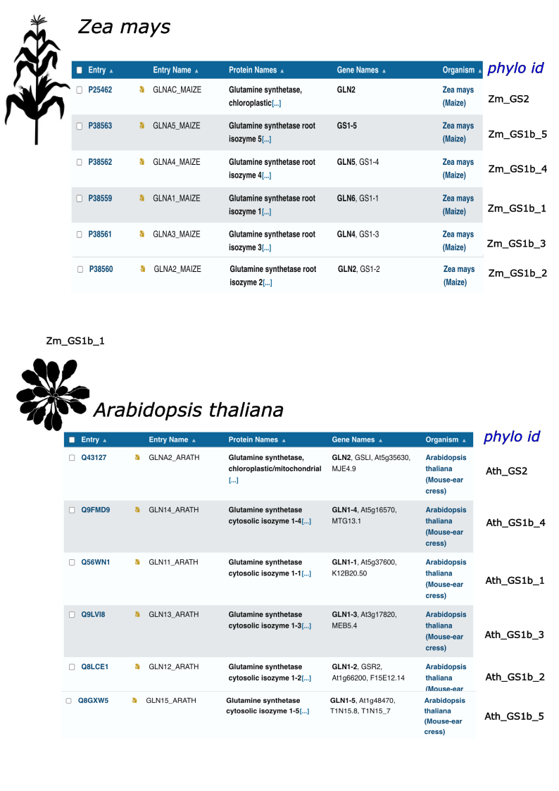
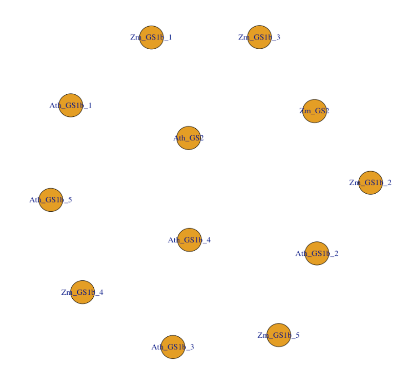
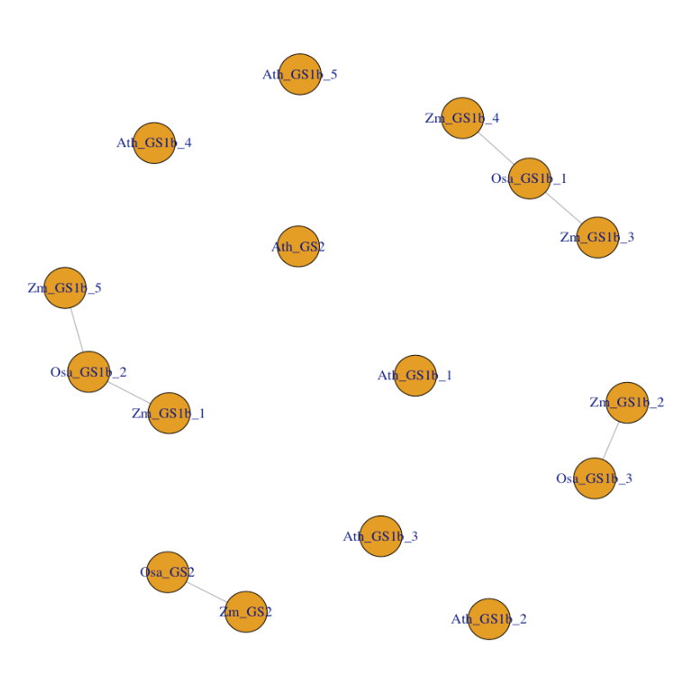
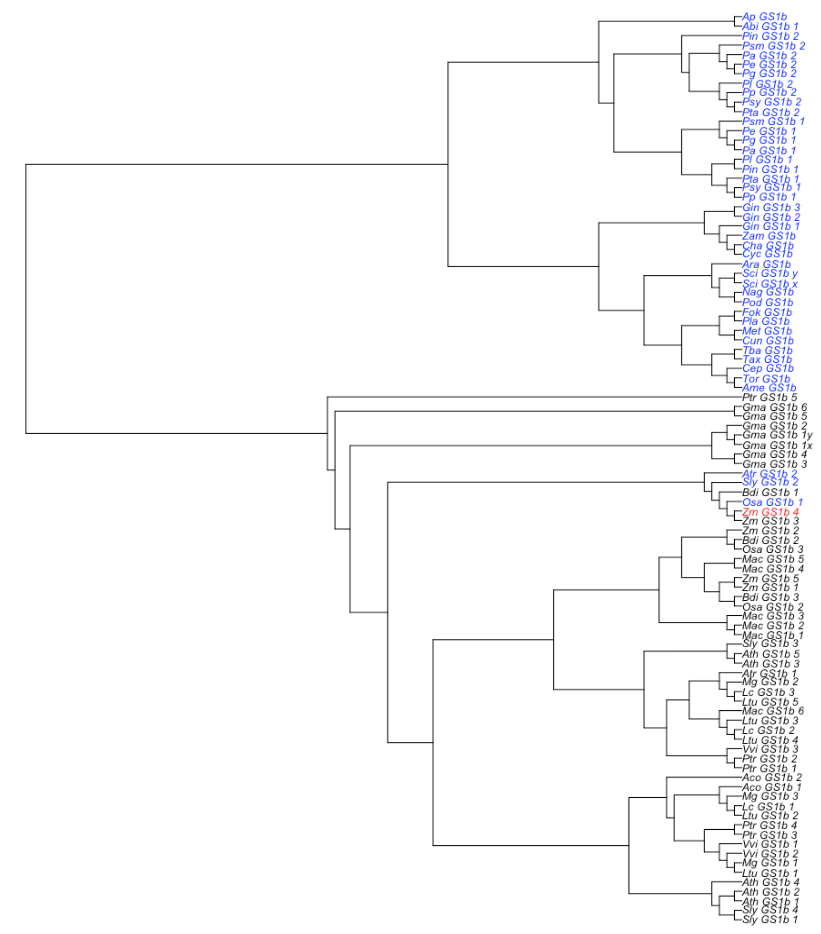

```{r, include = FALSE}
knitr::opts_chunk$set(
  collapse = TRUE,
  comment = "#>"
)
```

```{r, include = FALSE}
library(orthGS)
```

## Orthologs from crop in model plants and vice versa

Let's imagine you are a beginner in the field of plant science, and glutamine synthetase (GS) is on the focus of your interest. You have been dealing with the literature and you have come across with a paper that awaken your interest: "Atomic Structure of Plant Glutamine Synthetase. A Key Enzyme for Plant Productivity" (*J. Biol. Chem* **29**: 29287-29296). 

In this paper, the authors reports the crystal structure of maize GS. However, as the author acknowledge, higher plants have several isoenzymes of GS differing in heat stability and catalytic properties. The author refer to the isoenzyme they are characterizing as GS1a, being Ile-161 a key residue responsible for the heat stability of this protein. Your aim is to find, if they exist, orthologs of this maize protein in the model plant *Arabidopsis thaliana*. You may be a beginner, but you don't ignore that both maize and arabidopsis genomes have been shown to contain six GS genes each one. 

&nbsp;

{width=75%}

&nbsp;

At first you're slightly bewildered: none of the corn isoforms is called GS1a! But, everybody knows that GS1 implies a cytosolic form of the enzyme (while GS2 refer to the chloroplastic one), so our protein should be one of the five cytosolic isoenzymes present in maize. Taking into consideration that isoleucine should be present at position 161 and other information related to the sequence that is provided in the above mentioned paper, we conclude that GS1a match with GS1-4 from UniProt (or Zm_GS1b_4 using the phylo identifier of **orthGS**).

As a side note, point that the choice of GS1a to name this maize isoform was somewhat unfortunate. Indeed, among researcher in the gymnosperm field, GS1a is a term used to describe a set of evolutionary close cytosolic proteins whose expression and function is related to photosynthesis and photorespiration, reminiscent of GS2 in angiosperms.

In any case, we have already identified in maize the protein of interest (Zm_GS1b_4). Now, we have to look for orthologs in arabidopsis. Of course, the quickest and easiest way to do that is with the R package **orthGS**, but let's pretend for a moment that we don't know this resource. Thus, we are going to download all the arabidopsis and maize sequences, align them and build a phylogenetic tree, to see it this approach suggests something to us.

The function `subsetGS()` takes as argument the species of interest and return a dataframe with the sequences and information regarding the GS isoforms found in these species.

```{r}
maize_ara <- subsetGS(c("Zea mays", "Arabidopsis thaliana"))
```

Afterward, we can proceed with the alignment and phylogenetic tree construction. Ensure the 'muscle' package is installed. If necessary, uncomment the following lines of code.

```{r}
# if (!require("BiocManager", quietly = TRUE))
#     install.packages("BiocManager")
# 
# BiocManager::install("muscle")
```

```{r}
aln <- msa(sequences = maize_ara$prot, ids = maize_ara$phylo_id, inhouse = FALSE)
a <- aln$ali
rownames(a) <-  maize_ara$phylo_id
tr <- mltree(a)$tree
plot(phangorn::midpoint(tr), cex = 0.7)
```

If we want to be rigorous, and of course we want, in view of these results there is little, if anything, to conclude with respect to orthology relationships between maize and arabidopsis GS proteins. So, it's time to switch to a more suitable approach. Firstly, we will use the function `orthG()`, which takes as argument the set of species to be included in the analysis and return an orthology graph: two nodes (two GS proteins) are connected if and only if they are orthologs (also an adjacency matrix is provided if wished). 

```{r eval=FALSE, include=TRUE}
orthG(c("Zea mays", "Arabidopsis thaliana"))
```

{width=50%}

&nbsp;

Let's now include the rice in the set of species to be analyzed:

```{r eval=FALSE, include=TRUE}
orthG(c("Zea mays", "Arabidopsis thaliana", "Oryza sativa"))
```

{width=50%}

&nbsp;

As you can appreciate, the enzyme Osa_GS1b_1 is orthologous to the maize Zm_GS1b_4. Furthermore, rice and maize share a few orthologs, but arabidopsis has no orthologs neither in rice nor maize.

A function slightly different from the one we have just used, which you might find useful on occasion is `orthP()`. Let's see it in action:

```{r eval=FALSE, include=TRUE}
x <- orthP(phylo_id = "Zm_GS1b_4", set = "all")
plot(x[[1]], tip.color = x[[2]], cex = 0.7)
```

In red, the GS protein whose ortholgs we are searching for. In blue, the proteins detected as ortholgs in other plant species. 

{width=100%}

&nbsp;

While Zm_GS1b_4 is orthologous of any GS1b from gymnosperms, among the angiosperms we only find three orthologs: Atr_GS1b_2, Sly_GS1b2 and Osa_GS1b_1. To decode which species are Atr, Sly and Osa, we proceed as follows:

```{r}
speciesGS(c("Atr", "Sly", "Osa"))
```

